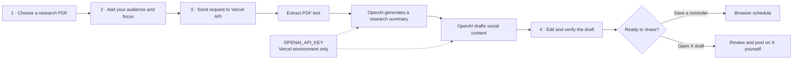

<div align="center">

# Fieldnote

### From research paper to reader-ready story.

Scientific work takes care to produce. Sharing it should make room for that
same care. Fieldnote helps turn research PDFs into clear, editable drafts—with
the source in view and a human making the final call.


**SOURCE → FOCUS → DRAFT → HUMAN REVIEW → SHARE**

</div>

---

## The workflow



> **Your source starts the process. You finish it.** Generated text is editable;
> Fieldnote does not publish posts automatically.

## Why Fieldnote

Research can be rigorous and still be hard to communicate beyond a specialist
audience. Fieldnote gives researchers and science communicators a practical
place to shape an initial draft from source material, then check every claim
before it goes anywhere.

## At a glance

| Bring the evidence | Shape the message | Keep control |
| --- | --- | --- |
| Upload PDF research papers | Give the draft an audience and focus | Edit before sharing |
| Up to 4 MB per request | Generate a summary and social copy | Open a pre-filled X draft |
| Extract text from each PDF | Create a short X version | Save local reminders |

## Built with

| Area | Implementation |
| --- | --- |
| Web interface | HTML, CSS, and browser JavaScript |
| Deployment | Vercel static site and Python function |
| PDF text extraction | `pypdf` |
| Hosted generation API | OpenAI Chat Completions API (`gpt-4o-mini`) |
| Original local interface | Streamlit and CrewAI |
| Local schedule | Browser `localStorage` in the web app |

## Contents

- [The workflow](#the-workflow)
- [Run the Streamlit app locally](#run-the-streamlit-app-locally)
- [Deploy the web app to Vercel](#deploy-the-web-app-to-vercel)
- [Notes and limitations](#notes-and-limitations)
- [Repository map](#repository-map)

## Run the Streamlit app locally

You’ll need **Python 3.12**. From the repository root, create and activate a
virtual environment, then install the local app dependencies:

```powershell
python -m venv .venv
.\.venv\Scripts\Activate.ps1
pip install -r requirements-streamlit.txt
```

Create a `.env` file in the repository root for the original Streamlit
interface:

```dotenv
GROQ_API_KEY=your_groq_api_key
```

Keep the real key private. Do not commit `.env` or paste a key into source code.
Start the app:

```powershell
streamlit run streamlit_app.py
```

## Deploy the web app to Vercel

1. Import this repository into Vercel and set the project root to the repository
   root.
2. In **Project Settings → Environment Variables**, add:

   | Name | Value |
   | --- | --- |
   | `OPENAI_API_KEY` | An active OpenAI API key with API access and available usage |

3. Apply the variable to the environment you are deploying (for example,
   **Production**).
4. Deploy, or redeploy after changing an environment variable.
5. Open the deployment and try a small, text-based PDF first.

The web API key is read on the server. It is not meant to be added to browser
JavaScript, HTML, or the Git repository. If generation fails after a successful
build, inspect the Vercel **Runtime Logs** for the `/api/generate` request;
build logs only show whether the deployment built and published.

To preview the Vercel web interface locally, install the Vercel CLI and run
`vercel dev` from the repository root after setting `OPENAI_API_KEY` in your
local environment.

## Notes and limitations

- The web API accepts PDF uploads totaling up to **4 MB** and extracts at most
  **5,000 characters per PDF** before generation.
- The hosted endpoint makes two sequential model requests. Usage limits, model
  availability, and charges depend on the OpenAI account and its current plan.
- A public Vercel deployment exposes the generation endpoint to its visitors.
  Use Vercel Deployment Protection if access should be restricted; the web UI
  does not use an app-password prompt.
- Scheduled web-app drafts are stored only in the current browser. They do not
  sync between devices, and reminders appear only while the page is open.
- The schedule is a reminder queue, not an automatic publishing service.
- Always compare generated claims with the source paper before sharing.
- The Streamlit app is a separate, local workflow and currently reads
  `GROQ_API_KEY`; the Vercel web endpoint uses `OPENAI_API_KEY`.

## Repository map

```text
.
├── api/
│   └── generate.py       # Vercel API: PDF extraction and OpenAI requests
├── assets/
│   └── arctic.jpg        # Fieldnote landing-page image
├── index.html            # Web app interface
├── script.js             # Upload, generation, editing, and schedule behavior
├── styles.css            # Responsive visual design
├── streamlit_app.py      # Original local Streamlit app
├── crew.py               # CrewAI research workflow
├── tasks.py              # Research task definition
├── agents.py             # Local agent configuration
├── pyproject.toml        # Vercel Python project dependencies
└── vercel.json           # Vercel function configuration
```

## Contributing

Issues and focused pull requests are welcome. For a useful bug report, include
the steps to reproduce the problem and the relevant error message, but remove
API keys, private research, and other sensitive information first.

---

<div align="center">

**Fieldnote** · Research first. Human approval always.

</div>
